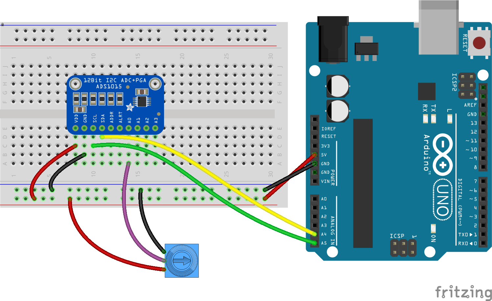
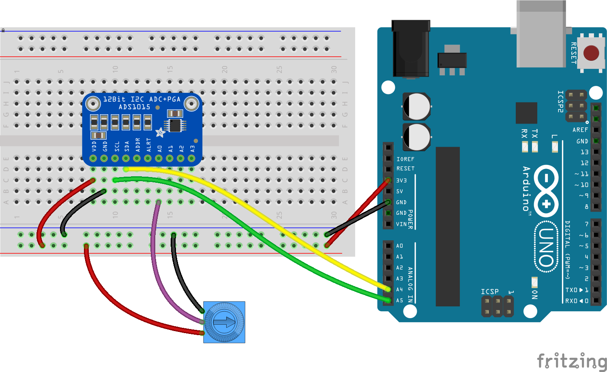
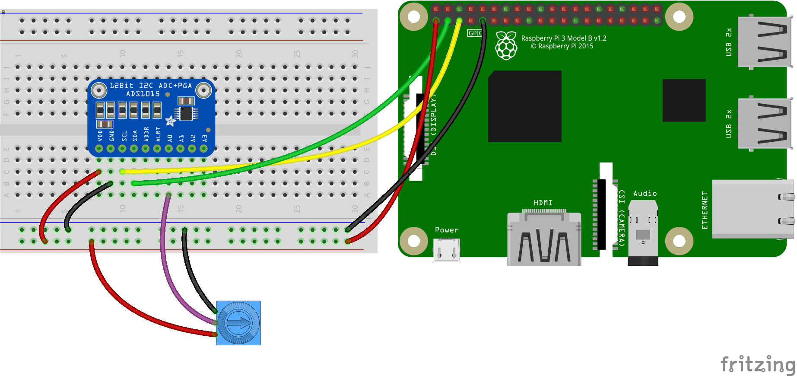

<!--remove-start-->

# Expander - ADS1015

<!--remove-end-->


Using an ADS1015 Expander as a Virtual Board (4 Pin Analog Input)


##### Documentation

**Expander Options**

<span class="abbreviate-table">

| Property   | Type   | Value/Description                                    | Default                |
|------------|--------|------------------------------------------------------|------------------------|
| controller | string | Controller name                                      | ADS1015                |
| address    | Number | 0x48, 0x49, 0x4A or 0x4B                             | 0x48                   |
| voltage    | Number | VDD voltage (usually 5 or 3.3)                       | 5                      |
| gain       | Number | Gain voltage (256, 512, 1024, 2048, 4096 or 6144)    | 6144 (5V), 4096 (3.3V) |
| frequency  | Number | Samples/sec (128, 250, 490, 920, 1600, 2400 or 3300) | 3300                   |
</span>

To change I2C address, connect ADDR PIN to Ground (or nothing), VDD, SDA, or SCL (see [datasheet](https://cdn-shop.adafruit.com/datasheets/ads1015.pdf) table 5).

ADS1015 has a 11-Bit resolution (12-Bit with _"not yet implemented"_ differential analog reading), so ADC range of values is `0-2047` (but `analog` range of values is still `0-255`)

##### Breadboard for "Expander - ADS1015" - 5V powered (default)

<br>

Fritzing diagram: [docs/breadboard/expander-ADS1015.fzz](breadboard/expander-ADS1015.fzz)

&nbsp;


Run this example from the command line with:
```bash
node eg/expander-ADS1015.js
```


```javascript
var Barcli = require("barcli");
var five = require("../lib/johnny-five.js");
var board = new five.Board();

board.on( "ready", function() {
  var bar = {
    raw: new Barcli({ label: "raw", range: [0, 2047] }),
    value: new Barcli({ label: "value", range: [0, 1023] }),
    analog: new Barcli({ label: "analog", range: [0, 255] }),
    scaled: new Barcli({ label: "scaled", range: [0, 100] })
  };
  var expander = new five.Board.Virtual(
    new five.Expander("ADS1015")
  );
  var analog = new five.Sensor({
    board: expander,
    pin: "A0"
  });
  analog.on("data", function() {
    bar.raw.update(this.raw);
    bar.value.update(this.value);
    bar.analog.update(this.analog);
    bar.scaled.update(analog.scaleTo(0, 100));
  });
});
```

##### Breadboard for "Expander - ADS1015" - 3.3V powered

<br>

Fritzing diagram: [docs/breadboard/expander-ADS1015-3V3.fzz](breadboard/expander-ADS1015-3V3.fzz)

&nbsp;


Run this example from the command line with:
```bash
node eg/expander-ADS1015-3V3.js
```


```javascript
var Barcli = require("barcli");
var five = require("../lib/johnny-five.js");
var board = new five.Board();

board.on( "ready", function() {
  var bar = {
    raw: new Barcli({ label: "raw", range: [0, 2047] }),
    value: new Barcli({ label: "value", range: [0, 1023] }),
    analog: new Barcli({ label: "analog", range: [0, 255] }),
    scaled: new Barcli({ label: "scaled", range: [0, 100] })
  };
  var expander = new five.Board.Virtual(
    new five.Expander({
      controller: "ADS1015",
      voltage: 3.3
    })
  );
  var analog = new five.Sensor({
    board: expander,
    pin: "A0"
  });
  analog.on("data", function() {
    bar.raw.update(this.raw);
    bar.value.update(this.value);
    bar.analog.update(this.analog);
    bar.scaled.update(analog.scaleTo(0, 100));
  });
});
```

##### Breadboard for "Expander - ADS1015" with a Raspberry Pi 3 - 3.3V powered

<br>

Fritzing diagram: [docs/breadboard/expander-ADS1015-raspberrypi3.fzz](breadboard/expander-ADS1015-raspberrypi3.fzz)

&nbsp;


Run this example from the command line with:
```bash
node eg/expander-ADS1015-raspberrypi3.js
```


```javascript
var Barcli = require("barcli");
var five = require("../lib/johnny-five.js");
// Raspberry Pi IO Plugins
var PiIO = require("pi-io"); // https://github.com/fivdi/pi-io
// var Raspi = require("raspi-io"); // https://github.com/nebrius/raspi-io
var board = new five.Board({
  io: new PiIO()
  // io: new Raspi()
});

board.on( "ready", function() {
  var bar = {
    raw: new Barcli({ label: "raw", range: [0, 2047] }),
    value: new Barcli({ label: "value", range: [0, 1023] }),
    analog: new Barcli({ label: "analog", range: [0, 255] }),
    scaled: new Barcli({ label: "scaled", range: [0, 100] })
  };
  var expander = new five.Board.Virtual(
    new five.Expander({
      controller: "ADS1015",
      voltage: 3.3
    })
  );
  var analog = new five.Sensor({
    board: expander,
    pin: "A0"
  });
  analog.on("data", function() {
    bar.raw.update(this.raw);
    bar.value.update(this.value);
    bar.analog.update(this.analog);
    bar.scaled.update(analog.scaleTo(0, 100));
  });
});
```

&nbsp;

<!--remove-start-->

## License
Copyright (c) 2012, 2013, 2014 Rick Waldron <waldron.rick@gmail.com>
Licensed under the MIT license.
Copyright (c) 2017 The Johnny-Five Contributors
Licensed under the MIT license.

<!--remove-end-->
